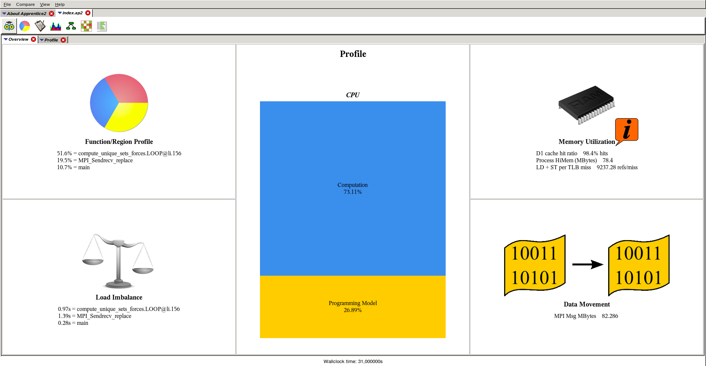
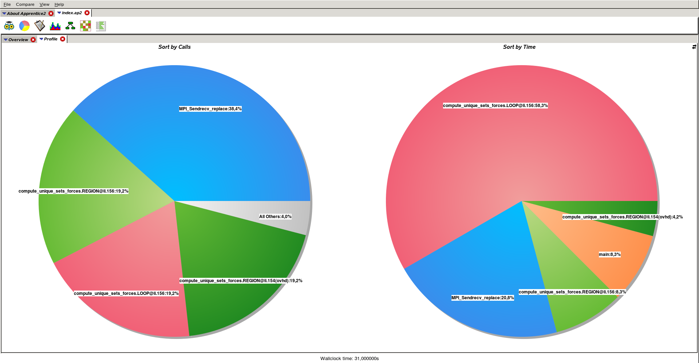
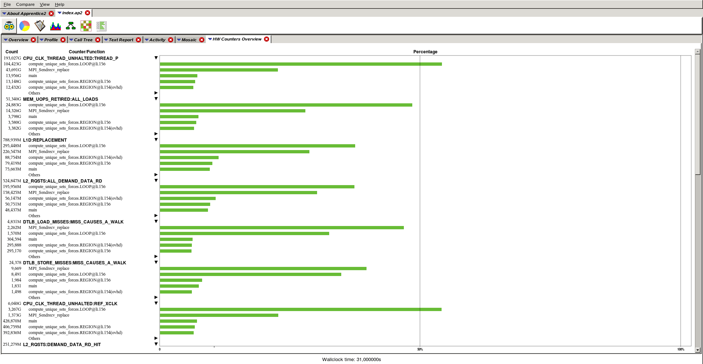
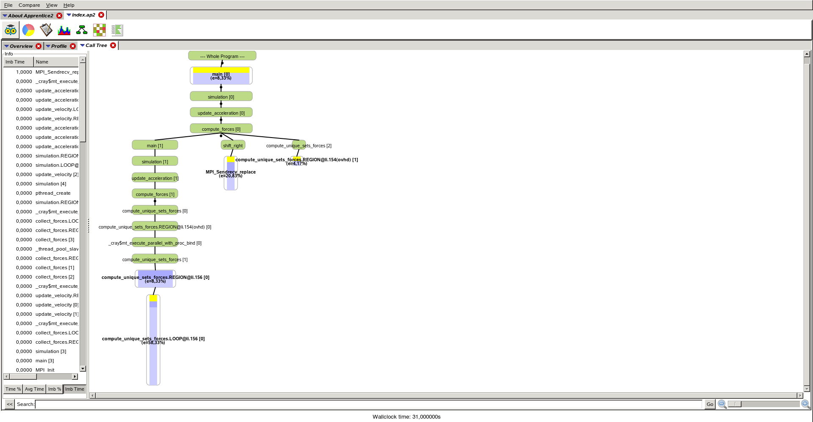

# Three-body-problem

This is an implementation of a classical [three body problem](https://en.wikipedia.org/wiki/Three-body_problem) for the [Axilrod-Teller Potential](https://en.wikipedia.org/wiki/Axilrod%E2%80%93Teller_potential). In order to achieve the best performance in distributed memory parallel programming model a novel algorithm for particle distribution across nodes was used:  
<https://www.researchgate.net/publication/282380541_A_Computation-_and_Communication-Optimal_Parallel_Direct_3-Body_Algorithm>.

The code is written using hybrid MPI-OpenMP programming model.

### Profilling results
Overall performance of the application

Time execution distribution

Time distribution as recorded by per hardware counter 

Function call graph

